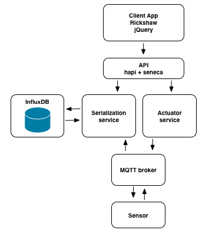

# Developing Microservices
This workshop will walk you through creating and composing a set of
microservices in Node.js using fuge, docker, and docker-compose.

__Note:__ This is a beginners level workshop. Whilst you should be comfortable
with Node.js modules and applications and have a basic understanding of docker
and it's principles we will be helping you through the basics. This workshop
presents a series of fairly simple challenges to help you get up to speed with
these technologies.

## The app
The app you're building is a sensor fed chart that provides realtime data from a
dummy sensor. This 'app' is broken down into a number of individual services,
each with its own well defined concern, as outlined in the following diagram.




### Frontend
A simple web app that uses jQuery, Rickshaw charts, and WebSockets to show
a realtime graph of data being emitted by our sensor. This app has an API
which is included in the same microservice who's sole job is to talk to
and read from other microservices.

### Actuator
A small microservice that causes reads on the sensor based on an offset.

### Sensor
A dummy temperature sensor that sends out varying values based on what it
receives from the actuator.

### Serialization
A service that handles reads and writes in serial fashion to the database. Uses
websocket-stream to update the web app and thus the graph, in real time.

### Broker
A robust messaging layer build for IoT based devices. We use this to wire up
the actuator, serializer, and sensor in a loosely coupled fashion.

### Influx
A database in a container that the serializer uses for robust storage of data.

Once we have built the application it should look a bit like this:


## The libraries
The system uses the following libraries and technologies:

* [Rickshaw Charts](http://code.shutterstock.com/rickshaw/) - Charting library for the web.
* [hapi](http://hapijs.com/) - A rich framework for building applications and services.
* [websocket-stream](https://www.npmjs.com/package/websocket-stream) - Websocket streams implementation for realtime communication to the browser.
* [browserify](http://browserify.org/) - Module to let you require modules client side by bundling up dependencies.
* [Seneca](http://senecajs.org/) - A Microservices framework for Node.js.
* [Mosca / MQTT](https://github.com/mcollina/mosca) - MQTT broker that enables robust message, particularly suited to IoT.
* [InfluxDB](https://influxdb.com/) - Time series database particularly suited to time sensitive data.
* [Fuge](https://github.com/apparatus/fuge) - A microservice development environment.
* [Docker](https://www.docker.com) - A container engine.


## Setting up
To complete this workshop you will need
[Node.js](https://nodejs.org/en/download/) and some supporting tools installed
on your laptop along with a working docker installation with an InfluxDB image.

You should follow the instruction for each component to get set up:

### Node.js
[Download](https://nodejs.org/en/download/) and install the latest stable build
of Node.js for your system.

### fuge
Once you have installed Node.js, fuge may be installed by running:

```bash
npm install -g fuge
```

### cURL
Windows does not come with cURL included in CMD.exe. If you are using Windows
please install cURL ensuring you select the version that matches your installed
version of Windows. cURL can be found at [https://curl.haxx.se/download.html]().
Please use the Windows generic version if using CMD.exe.

### Docker
Download the latest version for [mac](https://docs.docker.com/docker-for-mac/)
or [windows](https://docs.docker.com/docker-for-windows/) and install.

## Docker Compose
Download docker-compose at https://docs.docker.com/compose/install/.

Confirm that all is well by running:

```bash
docker ps
```

This tutorial uses a docker [influx db
container](https://hub.docker.com/r/tutum/influxdb/) you should pull this
container from the docker registry using the following command:

```bash
docker pull tutum/influxdb
```

You should also pull a Node.js container using:

```bash
docker pull node:6-slim
```

Once you have the following complete its time to move to [challenge 1](./challenge1/README.md).


### Workshop
You should clone this repository to your local machine:

```bash
git clone https://github.com/lloydbenson/microservices-workshop
```

Then setup the repository by installing the required Node.js modules:

```bash
cd microservices-workshop
npm install
```

### Slides

To follow along with the slides, after everything is installed execute the
following.

```bash
npm run slides
```

## Next Up: [Challenge 1](./challenge1/README.md)

Credits:  This was heavily borrowed and modified from
[https://github.com/nearform/micro-services-tutorial-iot]().  This was modified to
work with another workshop.


[Docker Cheat Sheet]: https://github.com/wsargent/docker-cheat-sheet
