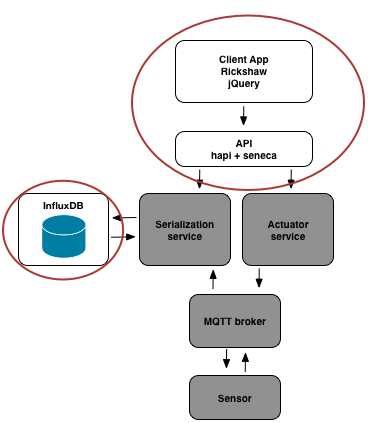

# Frontend



In this challenge we have a simple front end for our system. Let's start off by installing some dependencies and running it. Do the following:

If you haven't done so already, start by running `npm install` in the top level directory of this repo. Then run the frontend as follows:

1. `cd frontend/api`
2. `npm start`

Point your browser to http://localhost:10001. You should see a chart. Simple!

## Challenge 1
Next we are going to start up our database. To do this we are going to take advantage of Docker. If you haven't done this already you can fetch the influxDB container by running:

```
docker pull tutum/influxdb
```

Documentation on how to start the container can be found here: https://hub.docker.com/r/tutum/influxdb/

Your challenge is to startup the influxDB container. Once you have it running successfully open your browser and review the influx web interface.

## Next Up [challenge2](../challenge2/README.md)
